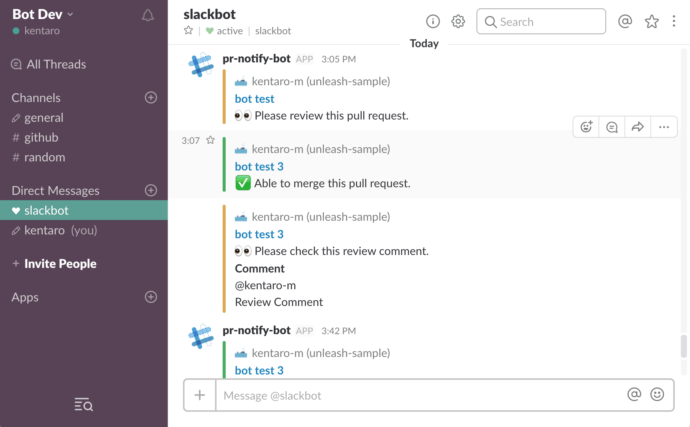

# pr-notify-bot
[]()

A bot that reminds reviewers to review their pull requests.

## Feature
* Automatic addition of reviewers to pull requests
* Send notifications to Slack
  * Pull request can be merged
  * Pull request review request is created
  * Mention comment is created on a pull request



## Usage
```
$ git clone https://github.com/kentaro-m/pr-notify-bot.git
$ cd pr-notify-bot
$ npm install
$ SLACK_API_TOKEN=<token> GITHUB_API_TOKEN=<token> SECRET_TOKEN=<secret> npm run start
```

### How to set up webhook on GitHub
* Go to your project settings > Webhooks > Add webhook
* **Payload URL** `https://<heroku-app-name>.herokuapp.com/`
* **Content type** `application/json`
* **Secret** any value
* **Events** Pull request, Pull request review, Pull request review comment

### How to run the bot on Heroku
```
{
  "host": "", // Required if using GitHub Enterprise
  "pathPrefix": "", // Required if using GitHub Enterprise
  "organization": "",
  "reviewers": [ // Pull request reviewers (GitHub username)
    "matsushita-kentaro"
  ],
  "approveComments": [ // Comment on approving pull request
    "+1",
    "LGTM"
  ],
  "numApprovers": 1, // Number of people required for pull request approval
  "slackUsers": { // Association between Slack user name and Github user name
    "matsushita-kentaro": "kentaro",
    "kentaro-m": "kentaro"
  },
  "message": { // Message to notify to Slack
    "requestReview": "Please review this pull request.",
    "ableToMerge": "Able to merge this pull request.",
    "mentionComment": "Please check this review comment."
  },
  "assignReviewers": true, // Bot adds a assignees to the pull request
  "requestReview": true, // Bot adds a reviewers to the pull request
  "ableToMerge": true, // Notify Slack that pull requests can be merged
  "mentionComment": true // Notify mention comment to Slack
}
```

Add reviewers (GitHub username), repositories and Slack username to `config/default.json`. Also, if necessary change other setting items.

[](https://heroku.com/deploy)

Deploy bot on Heroku.

* **GITHUB_API_TOKEN** A token for obtaining information on pull requests (scope: repo)
* **SLACK_API_TOKEN** A token for sending messages to Slack (scope: chat:write:bot)
* **SECRET_TOKEN** A token for securing webhook

Set environment variables after pressing "Deploy on Heroku" button.

## License
MIT
